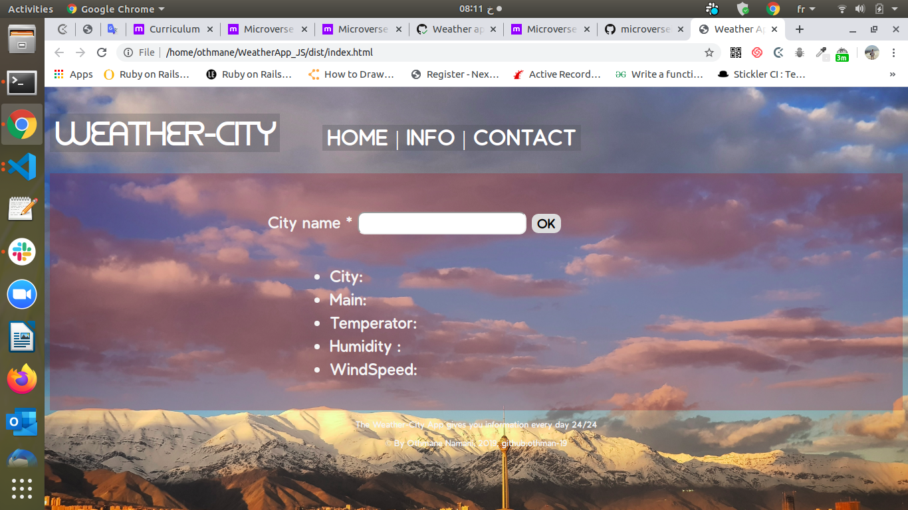

# # PROJECT: WEATHER APP.

> This project is part of a series of projects to be completed by students of [Microverse](https://www.microverse.org/ "The Global School for Remote Software Developers!").

The Weather App project comes at the end of the Asynchronous Javascript and APIs section of the Javascript course. It tests the knowledge of about asynchronous communication with promises or async/await and when to use them.

## Built With

- JavaScript (ES6/ES2015).
- HMTL/CSS.
- [Weather API](https://openweathermap.org/api).
- ES6 Modules.
- DOM manipulation.
- Webpack (NPM).
- ESlint.
- JavaScript async_await, promices, json, import/export modules and fetch data technics.

## Live Demo

[Live Demo Link](https://livedemo.com)

To get a local copy up and running follow these simple example steps.

### Prerequisites
  1. Git.
  2. Code editor.
  3. Code linter.
  5. Browser. 

## How to run the program
1. Open the terminal.

2. Enter `git clone https://github.com/othman-19/WeatherApp_JS`.

3. Navigate to the cloned repository.

4. In the terminal cd into WeatherApp_JS.

5. install webpack by typing `npm install webpack webpack-cli --save-dev` in terminal.

5. Install loaders by typing `npm install --save-dev style-loader css-loader file-loader` in terminal.

6. Open index.html in browser.

## Author(s)
1. [Othamane Naamani](https://github.com/othman-19/).

## 🤝 Contributing

Contributions, issues and feature requests are welcome!

Feel free to check the [issues page](issues/).

## Show your support

Give a ⭐️ if you like this project!

## Acknowledgments

- Hat tip to anyone whose code was used
- Inspiration
- etc

